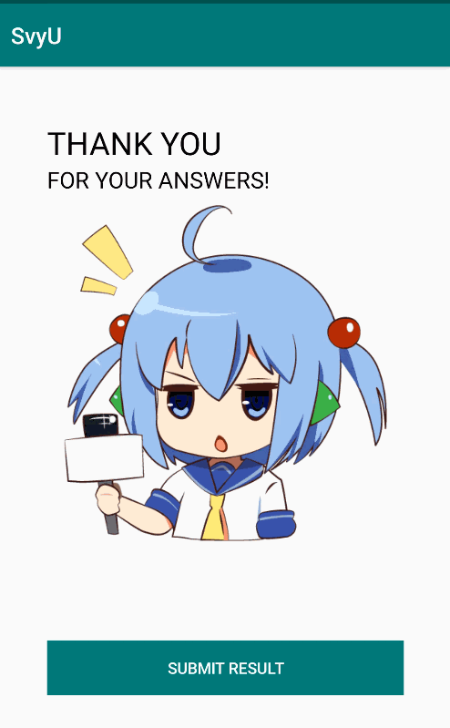

# README

# SvyU

Lab project for Mobile Development course.

## Introduction

The survey app is designated to conduct survey on mobile android app. 

While on the server side the questions is prepared and ID-related QR codes is formed, the survey can begin with just one scan of the code. Then the user answers these questions, when finished, the questions and additional info was saved locally and send to the server platform. Then the app is locked and other functions only can be accessed and continued by admin with special PINs.

## Demonstration

Permission & Scan QR

Answering questions

Answer Finished and App-Lock

## Functionalities

- Server-Side Questions & Code Generation
- Client-Side QR-Code Scanning
- Client-Side Answering Questions
- Client-Side Sending reports to server
- Client-Side Save To Local Storage
- Client-Side Lock app

## Functionalities of future improvement

- More Admin Functions

## Collaborators

Amber David Martin Ofrila Walter